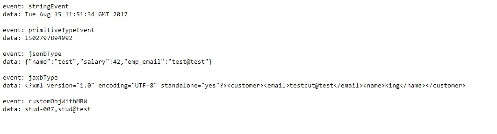

## Run locally on Docker

- `git clone https://github.com/abhirockzz/jaxrs-sse-mbw.git` 
- `mvn clean install` - this will produce `jaxrs-sse-mbw.war` in `target` directory
- `docker build -t <image_name> .` - this will create a Docker image
- `docker run --rm -it -p 8080:8080 <image_name>`
- what's the Docker host IP ? `docker-machine ip` (e.g. 192.168.99.100)

## Test it...

Access `http://<HOST_IP>/jaxrs-sse-mbw/sse/events` - You will get a SSE event with heterogeneous data types

